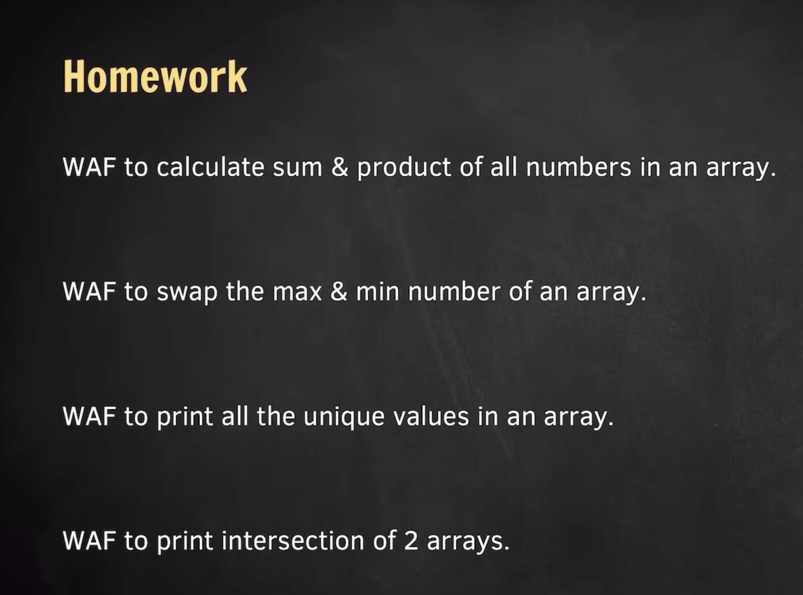

# Maximum & Minimum of an number 

- eak array me maximum value ko find krna hai to to usko hum INT_MIN se starting me compare krte hai and obviously koi v no to -infinity se bada hee hoga to first iteration me hee wo value update ho jata hai orr wo value harek index ke value se compare hota hai then jo last me sabse bada value milta hai wo print hota hai

- orr same scene minimum no ke case me v hota hai bsss isme hum minimum no ko pehle  INT_MAX ka value assign kr dete hai jo kee positive infinty hota hai so first iteration me hee yeah value comapre hoke update ho jaye fiir hum harek index ke value ko comapre krte hai kon chota hai jo chota hai wo value minimum wale variable me store ho jata hai

# Linear search

- Linear search me khash koi alag logic nhi hota hum bass eak target lete hai usko array ke harek index ke value se compare krke dekhte hai jo v index ka value target ke equal hota hai wahipe element found krke break kr dete hai orr jis v index value pe wo match hota hai usko return krn dete hai

# Reverse of an array

- isme hum 2 pointer approach use krte hai eak start jo kee hota hai start = 0 and end jo kee hota hai end = size - 1  fiir dono ko swap krke start ko ++ and end ko -- jabtak start < end rehta hai else wo loop se bahar aa jayenge
