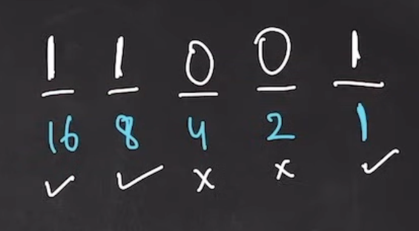

# Binary to decimal & decimal to binary ke kuch notes 
- koi v decimal no ke binary form nikalne ke liye hum usko 2 se divide krte hai kind of lcm form me orr fiir niche se upar tak uske remainder ko likhte hai
- same kisi v binaray no ka decimal form nikalne ke liye hum   
- yeah steps follow krne ke baad sare 1 position wale no ko add kr dete hai......
-               jis v binary no ke last position me 1 hota hai to wo decimal no ke odd no hote hai
# code part 
- decimal to binary me jyada kuch nhi bss kuch simple steps hote hai logicaly v dekhe to jaise kee pehle eak ans declare krenge 0 ke sath fiir pow ko 1 ke sath
-     fiir wo decimal no ka reminder nikalenge 2 se divide krke fiir uss no ko 2 se divide krke update v krenge for next iteration then abb steps aata hai power or ans jo declare kiye thhe uske
updation ka ans ke updation ke liye hum ans = ans + (rem * pow) , and for updation ke liye pow = pow * 10 thats it fiir iska function bana lo 

- Binary to decimal me almost same steps hai just hum waha binary ko 10 se divide krke reminder or number update krte hai and for power and ans ka updation power ko 2 se multiply krte hai answer ke liye same ans = ans + (rem * pow)

# Two's Compliment ( to store negative form of any number)

- for ex -10 ke liye pehle 10 ka binary jo le 1010 hai 
-      . Fir 1010 ke last me eak 0 add krenge jisko msb v bolte hai (most significatn bits) uske baad iska 1's complement lenge jisme jaha jaha 1 hai usko 0 orr jaha jaha 0 hai usko 1 kr denge jaise kee 10 ka binary tha 1010 msb add krne kw baad hua 01010 abb iska 1's compliment hoga 10101 ho gya ab isme hum 1 ko add krenge to wo number ho jayega 10110 isko hum memory me store krte time mark krenge kee yeah eak negative no hai wrna yeah no ka kuch orr hee value ho jayega instead of -10 

# Binary to decimal of a negative no

- pehle uss given no ka 1's complement nikalenge jaise 10110 ko decimal me krna hai and we know kee yeah yeah negative no hai to iska 1's complement hoga 01001 now we add 1 to this no jo kee hoga 01010 ho jayega jo kee 1o ka value hota hai
